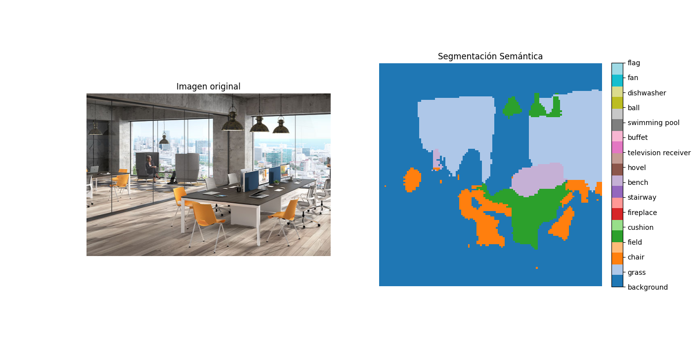

<p align="center">
  
</p>

### What is SegFormer?

SegFormer is a cutting-edge semantic segmentation framework developed by NVIDIA, designed to unify Transformers with lightweight multilayer perceptron (MLP) decoders. It features a novel hierarchical Transformer encoder that outputs multiscale features without the need for positional encoding, enhancing adaptability to varying input resolutions. The MLP decoder aggregates information from different layers, combining both local and global attention mechanisms to produce powerful representations.

> For an in-depth understanding, refer to the [original paper](https://arxiv.org/abs/2105.15203)

### Segmentation

Below is an example of semantic segmentation using a pre-trained SegFormer model:



###  How to use locally

1. **Clone the repository** (if you haven't already):
   ```bash
   git clone https://github.com/PaolaChaux/Proyecto-SegFormer-Analitica-de-Datos.git
   cd Proyecto-SegFormer-Analitica-de-Datos
   ```

> [!TIP]
> In the next step is highly recommended to use uv, since its way faster and the hole project was developed using uv. CHeck the docs [here](https://docs.astral.sh/uv/#uv)

2. Setup enviroment & requirements

    <details>
    <summary><b>Using <a href=https://docs.astral.sh/uv/>UV</a></b></summary>

    - Install uv
        ```
        curl -LsSf https://astral.sh/uv/install.sh | sh
        ```
    - Create a uv project
        ```
        uv init
        ```
    - Install dependencies:
        ```bash
        uv pip install --extra-index-url https://download.pytorch.org/whl/cu118 -r requirements.txt
        ```
    - Run the app
        ```
        uv run streamlit run src/appStreamlit.py
        ```
    </details>

    <details>
    <summary><b>Using pip</b></summary>

    - Create the enviroment
        ```
        python -m venv .venv
        ```
    - Activate the enviroment
        ```
        source .venv/bin/activate # Linux
        ```
        ```
        .venv\Scripts\activate # Windows
        ```
    - Install dependencies
        ```
        pip install --extra-index-url https://download.pytorch.org/whl/cu118 -r requirements.txt
        ```
    - Run the app
        ```
        streamlit run src/Homepage.py
        ```
    </details>

> [!NOTE]
> Keep in mind that the Dockerfile used to deploy its based on an image with uv preinstall.

### Additional Docs

- If you want to know more about the SegFormer and its architecture you can either run the streamlit app or refer to [here](docs/Architecture.md)

- If you want to know how was the deployment process in GCP, please refer to [here](docs/Deploy.md)


### 🧠 Inference Time Comparison by Computer and Video Resolution

| Video                                | Resolution      | Frames | Size        | Duration       | RTX 3050, 4 GB VRAM                        | GTX 1650 4 GB VRAM         |
|-------------------------------------|-----------------|--------|-------------|----------------|--------------------------------------------|------------------------------|
| **38579-418590125_tiny.mp4**        | 640x360 px      | 249    | 495.9 KB    | ~8.3 seconds   | 30.15s total (0.047s/frame) | 62.02s total (0.094s/frame)  |
| **13689328_2560_1440_30fps.mp4**    | 2560x1440 px    | 341    | 25.5 MB   | ~11.4 seconds  | 63.92s total (0.045s/frame) | 95.02s total (0.100s/frame)  |
| **3986275-HD_1080_1920_30fps.mp4**  | 1080x1920 px    | 596    | 12.9 MB     | ~19.9 seconds  | 83.84s total (0.045s/frame) | 145.41s total (0.091s/frame) |

